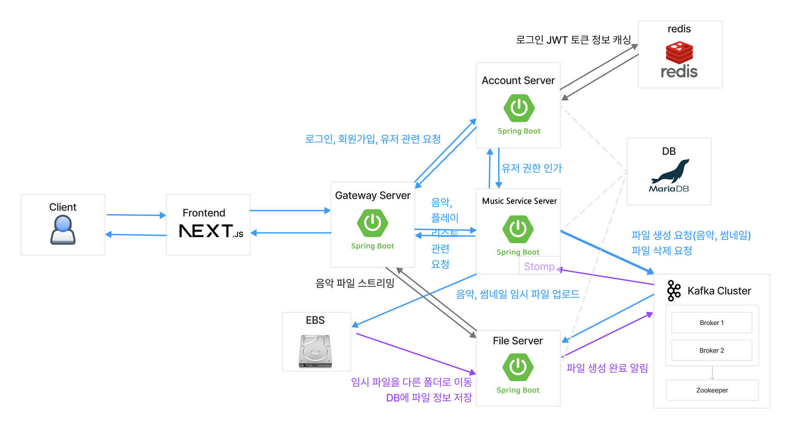
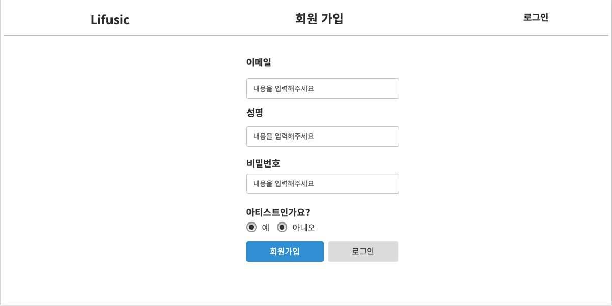
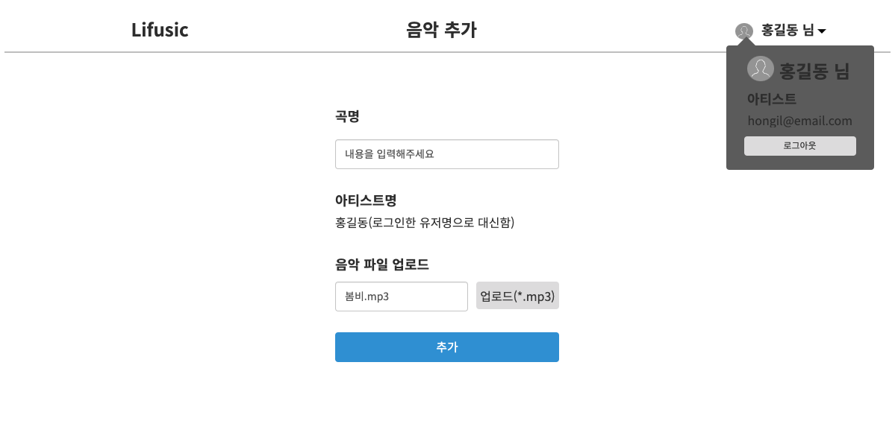
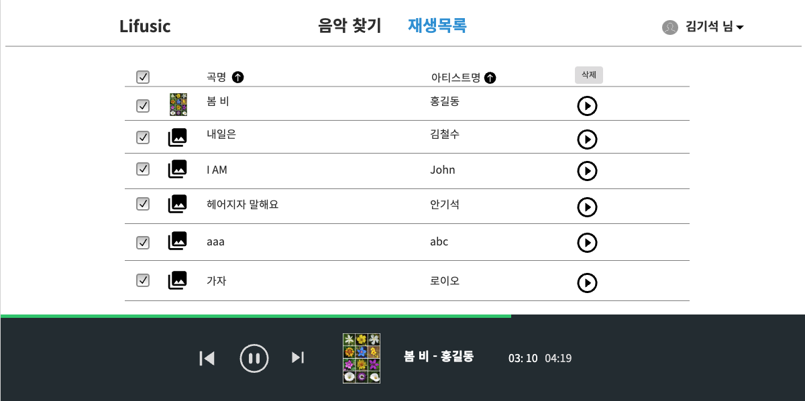

# Lifusic

## 프로젝트 설명

음악 스트리밍 서비스 프로젝트입니다.  
아티스트 권한으로 음악을 추가하거나, 다운로드할 수 있습니다.  
일반 고객 권한으로 음악을 찾거나, 플레이리스트에서 음악을 스트리밍할 수 있습니다.

## 프로젝트 기간

2023.09.05 ~ 2023.09.29

## 데모 영상

[](https://youtu.be/VDcTBL0wPMQ?si=1MLaXtcuR0DwEYdX 'Lifusic 데모')

## 데모 링크

http://lifusic.site  
음악 저작권 문제로, 유튜브 사운드 보관함에 있는 음악들을 업로드해두었습니다.
공개 과정에서 저작권 문제가 발생한다면 서버를 종료하도록 하겠습니다.

## Sub Repo List

각 서버가 마이크로서비스 아키텍처로 구성되었기 때문에 레포를 따로 나누었습니다.  
자세한 설명은 기획/개발 문서를 참고해주세요.

- [Account Server](https://github.com/chunghee-hwang/lifusic-account-server)
- [Gateway](https://github.com/chunghee-hwang/lifusic-gateway)
- [File Server](https://github.com/chunghee-hwang/lifusic-file-server)
- [Core Server](https://github.com/chunghee-hwang/lifusic-core-server)
- [Frontend](https://github.com/chunghee-hwang/lifusic-frontend/tree/main)

<details><summary><h2>MVP</h2></summary>

- Role: admin
  - 음악 등록
    - 곡 제목
    - 가수
    - 음악 파일 업로드(필수)
    - 썸네일 이미지 업로드(옵션)
- Role: customer
  - 음악 스트리밍
    - 앞으로 이동, 뒤로 이동, 전체/남은 시간 표시
  - 재생 목록
    - 음악 검색 후 재생하면 바로 재생 목록에 추가
    - 곡명, 아티스트명, 재생시간 노출
    - 재생목록 음악 곡명, 아티스트명으로 정렬
    - 재생목록 중 음악 하나, 다수 삭제 가능

</details>

## 아키텍처
  


- 백엔드(MSA)
  - DB
    - mariadb 사용
  - Kafka
    - 비용이 큰 파일 관련 요청을 처리하기 위함
    - 음악 등록 요청 ⇒ Rest API ⇒ core-server ⇒ 임시로 파일 저장 ⇒ kafka ⇒ file-server ⇒ 파일 생성 및 결과 전송 ⇒ kafka ⇒ core-server ⇒ 음악 메타 정보 db에 저장 ⇒ Stomp ⇒ frontend
    - 음악 삭제 요청 ⇒ Rest API ⇒ core-server ⇒ 음악 DB에서 삭제(프론트엔드에 완료되었다고 알림) ⇒ kafka ⇒ file-server ⇒ 파일을 DB와 파일 시스템에서 삭제
  - 음악 검색, 등록 서버(lifusic-core-server)
    - 음악 검색, 음악 등록 등 관련 서버
    - 음악 제목, 가수로 검색 가능
    - 검색 결과는 곡명, 아티스트명, 앨범명 노출
    - admin 용 음악 및 앨범 등록 가능
  - 파일 서버(lifusic-file-server)
    - 음악, 썸네일 파일을 관리하기 위해 volume을 마운트하고 있음
    - 파일 생성, 삭제, 다운로드, 스트리밍 담당
    - 파일 경로
      - 임시 저장 경로
        - /files/temp/${fileName}
      - 파일 경로
        - /file/${random-name}
  - Account 서버(lifusic-account-server)
    - 회원가입, 유저 인증 담당
  - Gateway 서버(lifusic-gateway)
    - Spring Cloud Gateway를 이용한 gateway
    - 프론트엔드에서 요청할 때 하나의 엔드포인트를 바라보기 위해 사용
    - 각 서버 포트를 숨김으로써 보안 향상
- 프론트엔드(lifusic-frontend)
  - 모놀리식으로 구성
</details>


## 기술 스택

### 백엔드

Java 17, Spring Boot 3.1.3, MariaDB 11.0.3, Kafka 7.5.0, Redis 7.2, Spring Security, Spring Cloud Gateway, Junit 5, Mockito

### 프론트엔드

Next.js 13.5.1, React.js 18.2.0, React Query, Typescript 5.2.2

### 배포

AWS EC2, Docker Compose

<details>
  <summary><h2>디자인 설계</h2></summary>
  https://ovenapp.io

- 로그인 페이지
  
- 회원가입 페이지

  

- 아티스트 → 음악 관리 페이지

  

- 음악 추가 페이지
  
- 음악 찾기 페이지

  

- 재생 목록 페이지
  
</details>


<details>
  <summary><h2>End Point</h2></summary>

### 아티스트 API

- 음악 목록 가져오기
  - GET /api/admin/musics?keyword=?&orderBy=name&orderDirection=asc|desc&limit=2&page=1
    - header
      ```
      Authorization: Bearer ${jwtToken}
      ```
  - 응답
    ```json
    {
        "allMusicSize": 5,
    		"page": 1,
        "musics": [
            {
                "id": 1,
                "name": "봄 비",
                "thumnailImageUrl": "http://proxyServerUrl/api/file/500"
            },
            {
                "id": 2,
                "name": "내일은",
                "thumnailImageUrl": "http://proxyServerUrl/api/file/501"
            }
        ]
    }
    ```
- 음악 다운로드
  - GET /api/admin/music/${musicId}/file
    - header
      ```
      Authorization: Bearer ${jwtToken}
      ```
  - 응답: 파일
- 음악 삭제 `Use Kafka`

  - POST /api/admin/music/deleteBatch

    - header
      ```
      Authorization: Bearer ${jwtToken}
      ```
    - request body
      ```json
      {
        "musicIds": [1, 5, 7]
      }
      ```

  - 응답 200 OK
    ```json
    {
      "success": true
    }
    ```

- 음악 추가 `Use Kafka`
  - 요청 POST /api/admin/music
    - header
      ```
      Authorization: Bearer ${jwtToken}
      ```
    - request body
      ```json
      {
          "musicName": "음악 제목",
          "musicFile": ${BinaryFile},
      		"thumnailImageFile": ${BinaryFile},
      }
      ```
  - 응답
    - Stomp Endpoint: “http://${gateway_host}/ws-endpoint
    - Subscription id: “/topic/post/admin/music/${userId}”
      ```json
      {
        "success": true
      }
      ```

### 고객 API

- 음악 하나 정보 가져오기
  - GET /api/music/${musicId}
    - header
      ```json
      Authorization: Bearer ${jwtToken}
      ```
  - 응답
    ```json
    {
      "musicId": 1,
      "fileId": 1000,
      "musicName": "봄 비",
      "artistName": "홍길동",
      "thumbnailImageUrl": "http://proxyServerUrl/api/file/500"
    }
    ```
- 음악 찾기 (음악 이름 또는 아티스트명으로 검색)
  - GET /api/music/list?keyword=홍길동&orderBy=name|artistName&orderDirection=asc|desc&limit=2&page=1
    - header
      ```
      Authorization: Bearer ${jwtToken}
      ```
  - 응답
    ```json
    {
      "allMusicSize": 100,
      "page": 1,
      "musics": [
        {
          "id": 1,
          "name": "봄 비",
          "artistName": "홍길동",
          "thumnailImageUrl": "http://proxyServerUrl/api/file/500"
        },
        {
          "id": 55,
          "name": "가을 비",
          "artistName": "홍길동",
          "thumnailImageUrl": null
        }
      ]
    }
    ```
- 재생 목록 만들기
  - POST /api/music/playlist
    - header
      ```
      Authorization: Bearer ${jwtToken}
      ```
    - request body
      ```json
      {
      	"name": "Chunghee's playlist 1"
      }
      ```
    - 응답
      ```json
      {
        "playlistId": 800,
        "name": "Chunghee's playlist 1"
      }
      ```
- “재생 목록”들 목록 가져오기
  - GET /api/music/playlist/all
    - header
      ```
      Authorization: Bearer ${jwtToken}
      ```
    - 응답
      ```json
      [
      	{
      		"id": 800,
      		"name": "Chunghee's playlist 1"
      		"createdAt": 1695204681384,
      	}
      ]
      ```
- 재생 목록에 음악 추가. 이미 있는 노래면 추가 안 함
  - PUT /api/music/playlist/one
  - 요청
    - header
      ```
      Authorization: Bearer ${jwtToken}
      ```
    - request body
      ```json
      {
        "musicId": 20,
        "playlistId": 1
      }
      ```
  - 응답 200 OK
- 재생 목록에 있는 음악 목록 가져오기
  - GET /api/music/playlist/${playlistId}?orderBy=name|artistName&orderDirection=asc|desc
    - header
      ```
      Authorization: Bearer ${jwtToken}
      ```
  - 응답
    ```json
    [
      {
        "musicInPlaylistId": 1,
        "musicId": 1,
        "fileId": 1000,
        "musicName": "봄 비",
        "artistName": "홍길동",
        "thumnailImageUrl": "http://proxyServerUrl/api/file/500"
      },
      {
        "musicInPlaylistId": 2,
        "musicId": 55,
        "fileId": 1001,
        "musicName": "가을 비",
        "artistName": "홍길동",
        "thumnailImageUrl": "http://proxyServerUrl/api/file/510"
      }
    ]
    ```
- 재생목록에서 음악 재생(stream)
  - GET /api/file/${fileId}/stream
  - 응답: file stream
- 재생목록에서 음악 삭제 (여러 개 삭제를 쉽게 하기 위해 POST 사용)
  - POST /api/music/playlist/batchDeleteMusics
  - 요청
    - request body
      ```json
      {
        "musicInPlaylistIds": [1, 2, 3, 4, 5]
      }
      ```
  - 응답: 200 OK

### 계정 API

- 로그인
  - POST /api/account/login
  - 요청
    - request body
      ```json
      {
        "email": "test@email.com",
        "password": "1234"
      }
      ```
  - 응답
    - 로그인 성공
      ```json
      {
        "token": "asdfnVIesorewiruadfsk.."
      }
      ```
    - 로그인 실패: 403 Forbidden
- 회원가입
  - POST /api/account/user
  - 요청
    - request body
      ```json
      {
      	"email": "test@email.com",
      	"name": "아티스트1",
      	"role": "customer|admin" // 일반 고객 or 아티스트
      	"password": "1234"
      }
      ```
  - 응답 200 OK
- 로그아웃
  - POST /api/account/logout
  - 요청
    - header
      ```
      Authorization: Bearer ${jwtToken}
      ```
  - 응답 200 OK
- 내 정보 가져오기
  - GET /api/account/me
    - header
      ```json
      Authorization: Bearer ${jwtToken}
      ```
  - 응답
    ```json
    {
    	"id": 123,
    	"email": "test@email.com",
    	"name": "아티스트1"
    	"role": "customer|admin" // 일반 고객 or 아티스트
    }
    ```
  
</details>


## DB 설계

### ERD


### 각 테이블 설명

- user 유저
  - id
  - email 이메일
  - name 유저 이름
  - password 비밀번호
  - role
    - admin 아티스트 (관리자)
    - customer 일반 고객
  - createdDate 생성일시
  - updatedDate 수정일시
- music 음악
  - id
  - name 음악 이름
  - artistId 아티스트 아이디
  - artistName 아티스트 이름(fetch 성능 향상을 위해 정규화X)
  - musicFileId 음악 파일 아이디
  - thumbnailFileId 썸네일 이미지 파일 아이디
  - createdDate 생성일시
  - updatedDate 수정일시
- playlist 플레이리스트
  - id
  - ownerId 플레이리스트 주인 아이디
  - createdDate 생성일시
  - updatedDate 수정일시
- musicInPlaylist 플레이리스트에 있는 음악
  - id
  - musicId 음악 아이디
  - playlistId 플레이리스트 아이디
  - createdDate 생성일시
  - updatedDate 수정일시
- file 파일
  - id 아이디
  - path 파일 경로
  - originalFileName 파일 이름(확장명 포함)
  - contentType
  - createdDate 생성일시
  - updatedDate 수정일시
